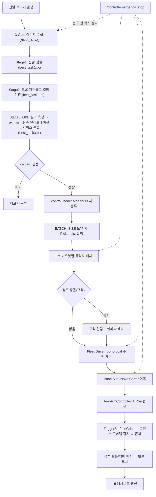

# 반품 신발 자동 분류/재고화 시스템 (cobot3_ws)

카메라로 반품된 신발을 검사(종류/사이즈/손상)하고, 판정 결과에 따라 AMR(Nova Carter)이 UR5e 로봇팔로 픽업해 지정된 위치까지 옮기는 과정을 NVIDIA Isaac Sim 위에서 End-to-End로 구현한 프로젝트입니다. Vision 판정 → 재고/배치 결정 → 다중 로봇 배차/주행 → 로봇팔 pick & place 까지 사람 개입 없이 이어지는 흐름을 시뮬레이션으로 검증합니다.

---

## 🛠️ 시스템 설계 (System Architecture)

### 전체 구조

시스템은 크게 **Perception(인식)**, **Decision(판단)**, **Control(제어)** 세 파트로 구성됩니다.

1. **Perception (`vision_node`)**: RealSense D455 카메라 3대(`/d455_1~3/color/image_raw`)의 이미지를 YOLO 3단계 파이프라인으로 처리합니다.
   - 1단계: 원본 전체 이미지에서 신발 검출 (`best_task1.pt`)
   - 2단계: 검출된 신발 영역을 크롭·확대해 결함(찢김 등) 재검출 — 원본에서는 결함이 너무 작아 놓치는 문제 보완 (`best_task2.pt`)
   - 3단계: 바닥 카메라(cam3)의 OBB 검출로 신발 길이(px)를 측정하고, 실측 캘리브레이션된 px→mm 변환으로 240/260/280mm 사이즈 분류 (`best_task3.pt`)
2. **Decision (`recycle_controller`)**: `control_node`가 Vision 판정 결과(`ShoeInspectionResult`)를 MongoDB(`inventory_db`)에 재고로 기록하고, 배치(batch) 단위로 목적지를 묶어 `PickupList`를 발행합니다. UI로부터 시작/일시정지/재시작/정지/리셋 서비스 요청도 처리합니다.
3. **Control (`sorting_line_fms` + `isaacpjt`)**: 아래 3단 구조로 실제 이동/작업을 수행합니다.
   - **FMS(`fms_node`, 관제탑)**: `PickupList`를 받아 로봇별 목적지를 배차하고, 노드/로봇 단위 2중 카운터로 교착(deadlock) 상태를 감지·알림
   - **Fleet Driver(`fleet_driver`, 중간 관리자)**: FMS의 목표 좌표를 받아 각 로봇의 `/odom`을 구독하며 go-to-goal 제어로 `/cmd_vel`을 계산 — Isaac Sim 의존성이 전혀 없어 시뮬레이션 없이도 단독 실행/테스트 가능
   - **Isaac Sim(`isaacpjt/mainsim`)**: 순수 물리 세계 — Nova Carter의 ROS2 디퍼렌셜 드라이브 브리지로 `/cmd_vel`을 받아 굴러가고, 도착 후 `AmrArmController`가 UR5e + 커스텀 `TriggerSurfaceGripper`로 픽업/배치를 수행

**안전 설계**: `/control/emergency_stop` 신호가 `control_node → FMS → Fleet Driver → (전 로봇 정지)`, `vision_node`(`/shoe_stop`)까지 전 구간에 전파되어 즉시 정지되는 것을 실제로 검증했습니다.

### 패키지 구조

| 패키지 | 역할 |
|---|---|
| `vision_node` | YOLO 3단계 신발 검사(검출/결함/사이즈) |
| `recycle_controller` | 판정 결과 재고화(MongoDB), 배치 단위 작업 지시, UI 서비스 처리 |
| `sorting_line_fms` | FMS(배차·교착 감지) + Fleet Driver(주행 제어) |
| `ui_node` | PyQt6 기반 모니터링/제어 대시보드 |
| `recycle_interfaces` | 커스텀 메시지/서비스(`ShoeInspectionResult`, `PickupList`, `AmrState`) |
| `cobot3_bringup` | 전체 ROS2 노드 통합 launch |
| `isaacpjt/mainsim` | Isaac Sim 시뮬레이션(AMR/UR5e/컨베이어/신발 스폰) |
| `isaacpjt/UR5E/rmpflow` | UR5e RMPflow 모션 제어, 커스텀 surface gripper, pick & place controller |

---

## 📊 알고리즘 플로우 차트 (Logic Flow)



---

## 💻 개발 환경 (Environment)

- **OS**: Ubuntu 22.04.5 LTS (Jammy Jellyfish)
- **Middleware**: ROS 2 Humble Hawksbill
- **Simulator**: NVIDIA Isaac Sim 5.1.0-rc.19
- **Language**: Python 3.10.12
- **DB**: MongoDB (`inventory_db`)
- **Key Libraries**: `rclpy`, `ultralytics`(YOLO), `torch`, `opencv-python`, `cv_bridge`, `pymongo`, `PyQt6`

## ⚙️ 사용 장비 (Hardware Setup, 시뮬레이션 기준)

본 프로젝트는 NVIDIA Isaac Sim 상의 **Nova Carter + UR5e(커스텀 surface gripper)** 조합을 기준으로 개발되었으며, 실기 연동 없이 시뮬레이션 환경에서 전체 파이프라인을 검증하는 것을 전제로 합니다.

| Component | Type | Topic / Spec |
|---|---|---|
| AMR | Nova Carter | Differential Drive Robot, `/<robot_id>/cmd_vel`, `/<robot_id>/odom` |
| Arm | UR5e + TriggerSurfaceGripper | PhysX 트리거 오버랩 기반 커스텀 흡착 그리퍼 |
| Vision | RealSense D455 ×3 | `/d455_1~3/color/image_raw` |
| Motion Planner | RMPflow | Nova Carter 챗시를 동적 장애물로 등록한 로봇별 인스턴스 |
| DB | MongoDB | `mongodb://localhost:27018` (`inventory_db`) |

---

## 📦 의존성 설치 (Installation)

### 0. Git Clone

git을 cobot3_ws 폴더로 불러옵니다

```bash
git clone https://github.com/banblock/rokey-A-3-pj3.git cobot3_ws
```

### 1. Python 필수 라이브러리

YOLOv8 추론, 영상 처리, DB 연동에 필요한 패키지입니다.

```bash
pip install ultralytics opencv-python torch pymongo PyQt6 numpy
```

### 2. ROS 2 패키지 빌드

```bash
cd ~/cobot3_ws
colcon build --symlink-install
source install/setup.bash
```

### 3. MongoDB 실행

`recycle_controller`가 접속하는 기본값(`db_manager.py`)은 로컬 27018 포트입니다. 예: Docker로 실행 시

```bash
docker run -d --name inventory-mongo -p 27018:27017 \
  -e MONGO_INITDB_ROOT_USERNAME=admin \
  -e MONGO_INITDB_ROOT_PASSWORD=mongodb_password \
  mongo
```

---

## 🚀 실행 순서 (How to Run)

전체 시스템을 구동하기 위해 아래 순서대로 터미널을 실행하세요.

### 1. Isaac Sim 실행 (Simulation)

```bash
# 시뮬레이션 컴퓨터
cd ~/cobot3_ws/isaacpjt/mainsim
export LD_LIBRARY_PATH=$LD_LIBRARY_PATH:$HOME/dev_ws/isaac_sim/isaacsim/_build/linux-x86_64/release/exts/isaacsim.ros2.bridge/humble/lib
~/dev_ws/isaac_sim/python.sh main_sim.py
```

`demo0728_v3.usd` 씬을 로드하고 Nova Carter(들)을 스폰한 뒤, ROS2 diffdrive 브리지와 `AmrArmController`를 초기화합니다.

### 2. MongoDB 실행 확인

위 [의존성 설치 3번](#3-mongodb-실행)의 컨테이너/인스턴스가 떠 있어야 `control_node`가 정상 기동합니다.

### 3. ROS 2 노드 전체 실행 (Vision + Control + FMS + UI)

```bash
# 시스템 컴퓨터
source /opt/ros/humble/setup.bash
source ~/cobot3_ws/install/setup.bash
ros2 launch cobot3_bringup all.launch.py
```

개별 노드만 선택 실행하려면 launch 인자로 끌 수 있습니다.

```bash
ros2 launch cobot3_bringup all.launch.py use_vision:=false use_ui:=false
```

메인 컨트롤(실제 작업 지시) 노드 없이 FMS/Fleet Driver만 단독으로 확인하려면:

```bash
ros2 launch sorting_line_fms sorting_line.launch.py use_main_control_stub:=true
```

